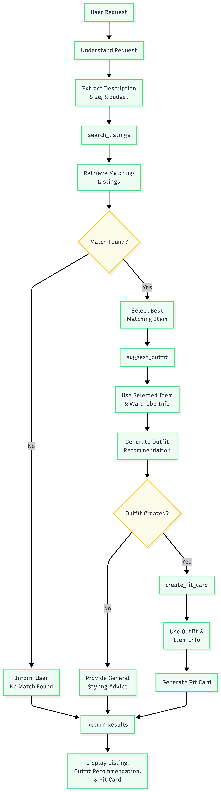

# FitFindr — planning.md

> Complete this document before writing any implementation code.
> Your spec and agent diagram are what you'll use to direct AI tools (Claude, Copilot, etc.) to generate your implementation — the more specific they are, the more useful the generated code will be.
> Your planning.md will be reviewed as part of your submission.
> Update it before starting any stretch features.

---

## Tools

List every tool your agent will use. For each tool, fill in all four fields.
You must have at least 3 tools. The three required tools are listed — add any additional tools below them.

### Tool 1: search_listings

**What it does:**
<!-- Describe what this tool does in 1–2 sentences -->
The search listing basically retrieves the data base on the users request and it uses an ID system base on what the user requested like size and price.

**Input parameters:**
<!-- List each parameter, its type, and what it represents -->
- `description` (str): ... - Describes the Item and what item is 
- `size` (str): ... - Describes the Size of the item like its small or large
- `max_price` (float): ... - Describes the full price of the Item.

**What it returns:**
<!-- Describe the return value — what fields does a result contain? -->
The return value would be base on the ID that fit the user`s description and like the max price or size

**What happens if it fails or returns nothing:**
<!-- What should the agent do if no listings match? -->
It should tell the user that it does not have the information if the specific listing is not found.

---

### Tool 2: suggest_outfit

**What it does:**
<!-- Describe what this tool does in 1–2 sentences -->
It suggests an outfit using the selected listing and the user's wardrobe. It gives styling ideas that match the listing and the user's existing pieces.

**Input parameters:**
<!-- List each parameter, its type, and what it represents -->
- `new_item` (dict): The item the user is thinking of buying, from the search results.
- `wardrobe` (dict): The user's saved wardrobe items, which the outfit should match.

**What it returns:**
<!-- Describe the return value -->
A text description of one or two outfit ideas that pair the selected item with wardrobe pieces.

**What happens if it fails or returns nothing:**
<!-- What should the agent do if the wardrobe is empty or no outfit can be suggested? -->
If the wardrobe is empty or no clear outfit can be made, it should still give helpful styling advice for the item.

---

### Tool 3: create_fit_card

**What it does:**
<!-- Describe what this tool does in 1–2 sentences -->
It makes a short fit card or caption from the outfit suggestion and item details.

**Input parameters:**
<!-- List each parameter, its type, and what it represents -->
- `outfit` (str): The outfit suggestion text created by the previous tool.
- `new_item` (dict): The selected listing item used to make the fit card.

**What it returns:**
<!-- Describe the return value -->
A brief, shareable caption that describes the outfit vibe and the chosen item.

**What happens if it fails or returns nothing:**
<!-- What should the agent do if the outfit data is incomplete? -->
If the outfit info is missing, it should say the fit card can't be created and keep the tone friendly.

---

### Additional Tools (if any)

<!-- Copy the block above for any tools beyond the required three -->

---

## Planning Loop

**How does your agent decide which tool to call next?**
<!-- Describe the logic your planning loop uses. What does it look at? What conditions change its behavior? How does it know when it's done? -->
The agent starts by reading the user's request and extracting the important details, such as the item description, size, and budget. It then uses `search_listings` to look for matching listings in the dataset.

The first condition checks whether a match was found. If no matching listing is found, the agent stops the process and tells the user that no match was found. This prevents the agent from making up information.

If a match is found, the agent selects the best matching item and passes it to `suggest_outfit`. The agent then uses the selected item and the user's wardrobe information to create an outfit recommendation.

The second condition checks whether an outfit was successfully created. If an outfit cannot be created, the agent gives general styling advice instead. If an outfit is created, the agent passes the outfit and item information to `create_fit_card`, which generates the final fit card.

Finally, the agent returns the results to the user, including the listing, outfit recommendation, and fit card when available.

---

## State Management

**How does information from one tool get passed to the next?**
<!-- Describe how your agent stores and accesses state within a session. What data is tracked? How is it passed between tool calls? -->

---

## Error Handling

For each tool, describe the specific failure mode you're handling and what the agent does in response.

| Tool            | Failure mode                               | Agent response                                                                       |
| --------------- | ------------------------------------------ | ------------------------------------------------------------------------------------ |
| search_listings | No matching item is found                  | Tell the user that no matching item was found and suggest trying a different search. |
| suggest_outfit  | The wardrobe is empty                      | Give general outfit ideas instead of personalized recommendations.                   |
| create_fit_card | Not enough outfit information is available | Let the user know a fit card could not be created with the available information.    |

---

## Architecture

<!-- Draw a diagram of your agent showing how the components connect:
     User input → Planning Loop → Tools (search_listings, suggest_outfit, create_fit_card)
                                                                          ↕
                                                                   State / Session
     Show what triggers each tool, how state flows between them, and where error paths branch off.
     ASCII art, a Mermaid diagram (https://mermaid.js.org/syntax/flowchart.html), or an embedded
     sketch are all fine. You'll share this diagram with an AI tool when asking it to implement
     the planning loop and each individual tool. -->

---

## AI Tool Plan

For this project, I plan to use ChatGPT as my main planning and debugging assistant. I will use ChatGPT to help me think through the agent diagram, explain logic I do not fully understand yet, and improve my planning document. I will provide my tool descriptions, agent diagram, and project requirements as input. I expect ChatGPT to help me clarify the flow of the agent, explain how each tool connects, and help me debug problems when the implementation does not work as expected.

I will also use GitHub Copilot inside VS Code while writing code. I plan to use Copilot for small coding suggestions, polishing comments, and helping me understand how to structure certain functions. I will not rely on Copilot blindly. I will check that the code matches my planning document, especially the tool inputs, return values, and error handling.

To verify the AI-generated help, I will test each part of the project step by step. First, I will test `search_listings` with different user queries to make sure it returns relevant results. Then I will test `suggest_outfit` with both an example wardrobe and an empty wardrobe. Finally, I will test `create_fit_card` to make sure it creates a clear final response. If the output does not match my agent diagram or my intended behavior, I will revise the code and ask follow-up questions until the logic works correctly.

**Milestone 3 — Individual tool implementations:**

**Milestone 4 — Planning loop and state management:**

---

## A Complete Interaction (Step by Step)

Write out what a full user interaction looks like from start to finish — tool call by tool call. Use a specific example query.

**Example user query:** "I'm looking for a vintage graphic tee under $30. I mostly wear baggy jeans and chunky sneakers. What's out there and how would I style it?"

**Step 1:**
<!-- What does the agent do first? Which tool is called? With what input? --> 
I believe the agent's job is to retrieve accurate information based on the user's request. It returns matching results according to relevance. It uses `search_listings`, which searches through specific IDs related to what the user is looking for.

**Step 2:**
If `search_listings` returns results and the user wants styling, call `suggest_outfit` using the selected listing and the user's wardrobe. This generates a suggested outfit based on the search result and user preferences.
**Step 3:**
After creating the outfit suggestion, the agent prepares the response using the matched listing, the suggested outfit, and the user’s request details. If no match is found or no outfit can be generated, it responds clearly that the request cannot be fulfilled.
**Final output to user:**
The user receives the matching item suggestions plus styling advice when requested, or a clear message explaining that no suitable match was found.
